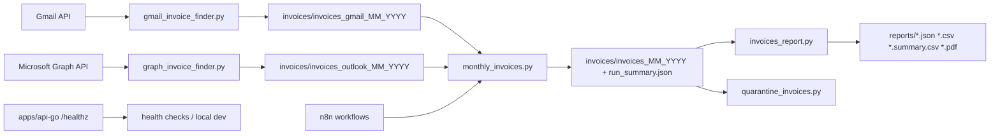

# Architecture

## Overview

This repository is a CLI-first invoice processing monorepo with two implemented execution surfaces:

- Python workers under `apps/workers-py` for mailbox ingestion, PDF handling, monthly orchestration, quarantine, and reporting.
- A minimal Go HTTP service under `apps/api-go` that currently exposes only `GET /healthz`.

The current system is centered on files, not a database-backed application model:

- Inputs arrive from Gmail or Microsoft Graph.
- PDFs and run artifacts are written to provider and monthly folders under `invoices/`.
- Reports are generated as JSON, CSV, summary CSV, and PDF under `reports/` or caller-provided output paths.
- Local automation is driven by `make` targets and optional n8n workflows in the Compose stack.

## Runtime Topology

## Code Map

### `apps/workers-py/src/invplatform/cli`

This is the real application layer today. Most business flow still lives in CLI modules rather than a separate service or orchestration package.

- `gmail_invoice_finder.py`
  - Gmail OAuth login, message query construction, attachment download, link extraction, provider-specific browser/download flows, PDF relevance checks, and output writing.
- `graph_invoice_finder.py`
  - Graph/MSAL auth, mailbox pagination, attachment and link download, Bezeq browser fallback, PDF verification, and output writing.
- `monthly_invoices.py`
  - Month window calculation, parallel provider execution, provider-folder deduplication, consolidated copy, and `run_summary.json`.
- `invoices_report.py`
  - PDF text extraction, vendor-specific parsing heuristics, record normalization, totals, CSV/JSON output, and rendered PDF reporting.
- `quarantine_invoices.py`
  - Recursive scan of a directory tree and movement of low-confidence/non-invoice PDFs into `quarantine/`.
- `meta_billing_export.py`
  - Separate Graph-based export utility; adjacent to the invoice workflows, but not part of the main invoice ingestion/reporting path.

### `apps/workers-py/src/invplatform/domain`

This package contains reusable low-level helpers that multiple CLIs can share:

- `files.py`
  - directory creation, filename sanitization, unique path allocation, message tags, byte hashing.
- `pdf.py`
  - text fingerprinting, keyword extraction, PDF confidence scoring.
- `relevance.py`
  - message/body/link heuristics such as `should_consider_message`, municipal markers, positive/negative signal checks, and domain filtering.

### `apps/workers-py/src/invplatform/usecases` and `adapters`

These packages show the beginning of a more layered design, but they are not yet the dominant execution path.

- `adapters/base.py`
  - defines a `MailAdapter` protocol plus `MessageMeta` and `AttachmentMeta` transport types.
- `usecases/fetch_invoices.py`
  - currently contains only a minimal fetch pass-through.

In practice, the Gmail and Graph CLIs still embed their own adapter, scoring, download, and persistence logic directly.

### `apps/api-go`

The Go side is intentionally small right now:

- `cmd/invoicer/main.go`
  - registers `GET /healthz`
  - listens on `:8080`

There is no implemented invoice CRUD/API surface yet in the Go app.

## Main Flows

### 1. Gmail Ingestion Flow

`gmail_invoice_finder.py` is a stateful CLI pipeline:

1. Authenticate with Gmail using `credentials.json` and `token.json`.
2. Build a query from `--start-date` and `--end-date`, or use an explicit query.
3. List candidate messages and prefilter them with subject/preview heuristics.
4. Fetch full message payloads when needed.
5. Download invoice candidates from:
   - direct attachments
   - extracted message links
   - provider-specific browser/network flows such as Bezeq and YES
6. Run PDF relevance checks before accepting files.
7. Write accepted PDFs plus optional JSON/CSV/candidate/non-match artifacts.

Important architectural characteristics:

- The Gmail path mixes API access, heuristics, browser automation, and file persistence in one module.
- Duplicate prevention uses file hashes, normalized stems, and text fingerprints against the target directory.
- The output directory is the system-of-record boundary for downstream monthly and reporting steps.

### 2. Microsoft Graph Ingestion Flow

`graph_invoice_finder.py` follows the same high-level contract as the Gmail finder, but with Graph-specific auth and traversal:

1. Acquire a token through MSAL using `client_id`, `authority`, and an optional persistent token cache.
2. Iterate mailbox messages over a date window, with optional Sent Items exclusion.
3. Score/filter messages with invoice heuristics.
4. Download attachments and link-based PDFs.
5. Use Playwright-based fallback for Bezeq flows when a direct fetch is not enough.
6. Verify candidate PDFs and write accepted outputs and optional audit artifacts.

Important architectural characteristics:

- `GraphClient` encapsulates auth, token refresh, retry logic, folder lookup, and paginated message reads.
- Scheduled/non-interactive use is supported through `--token-cache-path`; the CLI exits with `AUTH_REQUIRED` when a cache is missing or expired.
- The finder is optimized for unattended runs but still shares the same file-first boundary as Gmail.

### 3. Monthly Orchestration Flow

`monthly_invoices.py` is the coordinator for the two mailbox ingestors.

Responsibilities:

1. Compute the `[start_date, end_date)` window for a target month.
2. Build provider runs for Gmail and/or Graph.
3. Execute provider jobs in parallel by default.
4. Deduplicate PDFs inside each provider directory.
5. Consolidate accepted PDFs into `invoices/invoices_MM_YYYY`.
6. Write `run_summary.json` with execution, dedupe, and consolidation metadata.

This module is important because it is the only implemented cross-provider workflow. It is also the main entrypoint used by local scheduling and n8n automation.

### 4. PDF Parsing and Reporting Flow

`invoices_report.py` is the largest single module in the repo and acts as the reporting engine.

Responsibilities:

1. Read PDFs from a folder or selected file list.
2. Extract text primarily through `pdfminer`, with PyMuPDF fallback where needed.
3. Parse invoice metadata:
   - vendor
   - invoice id
   - invoice date
   - due date
   - totals
   - VAT
   - billing period
   - category/classification
   - municipal and vendor-specific variants
4. Produce normalized `InvoiceRecord` values.
5. Emit:
   - JSON rows
   - CSV rows
   - summary CSV totals
   - a rendered PDF report with bilingual-safe text handling and optional vendor subtotals

Architecturally, this is a heuristic parser rather than a schema-driven extraction service. Vendor-specific knowledge is encoded directly in Python functions, and the report generator owns both parsing and presentation.

### 5. Quarantine and Deduplication

Two mechanisms protect report quality before or during downstream processing:

- `quarantine_invoices.py`
  - re-scans PDFs and moves weak candidates into `quarantine/`
- `monthly_invoices.py`
  - deduplicates provider folders and skips duplicate copies during monthly consolidation

The repo therefore uses the filesystem itself as the main state machine:

- accepted PDFs stay in the active tree
- duplicates move to `duplicates/`
- rejected/low-confidence files move to `quarantine/`

## Compose and Local Stack

`deploy/compose/docker-compose.dev.yml` provisions five services:

- `api-go`
  - builds from `deploy/docker/Dockerfile.api-go`
  - exposes `:8080`
- `workers-py`
  - builds from `deploy/docker/Dockerfile.workers-py`
  - mounts `../../storage` to `/data/files`
- `n8n`
  - builds from `integrations/n8n/Dockerfile`
  - mounts the whole repo at `/workspace`
  - passes `GRAPH_CLIENT_ID` through for scheduled monthly runs
- `db`
  - PostgreSQL 16
- `mq`
  - RabbitMQ with management UI

### What the stack is used for today

- `api-go` provides a containerized health endpoint.
- `n8n` is the implemented automation surface for scheduled monthly runs and Graph bootstrap runs.
- `workers-py` is a generic Python runtime container, not a long-lived worker process with queue consumption.

### What is provisioned but not yet wired into app code

Postgres and RabbitMQ are present in Compose, but the current application code does not contain implemented database or message-broker usage. Today’s ingestion, orchestration, and reporting flows are still local-process and filesystem based.

## Automation Model

There are two orchestration layers in practice:

- `Makefile`
  - canonical local operator interface
  - wraps the Python CLIs and Compose lifecycle
- `integrations/n8n/workflows/*.json`
  - scheduled automation wrappers around the same monthly CLI flow

This is an important architectural choice: automation reuses the CLI entrypoints instead of calling an internal API or queue-driven worker.

## Persistence Model

Current persistence is file-oriented:

- mailbox fetchers write PDFs and run artifacts to provider directories
- monthly orchestration writes a consolidated directory and `run_summary.json`
- reporting writes derived artifacts under `reports/`
- auth state is stored in OAuth files or an MSAL token cache path

There is no implemented central application database for invoices, vendors, run history, or review state.

## Operational Boundaries

### Stable Boundaries

- Provider ingestion boundary:
  - Gmail and Graph finders both produce invoice files plus audit artifacts on disk.
- Monthly boundary:
  - `monthly_invoices.py` consumes provider directories and produces a canonical monthly directory.
- Reporting boundary:
  - `invoices_report.py` consumes a directory of PDFs and produces report artifacts.

### Weak Boundaries

- Gmail and Graph CLIs each contain substantial business logic, provider quirks, and persistence details.
- The domain/usecase/adapter packages exist, but most workflow logic has not yet been extracted into them.
- The Go API and Compose stack do not yet front or coordinate the Python workflows.

## Current Architecture Summary

The repo is best understood as:

- a mature Python CLI application for invoice ingestion and reporting
- plus a minimal Go health service
- plus a local automation/dev stack around those CLIs

It is not yet a service-oriented platform with shared persistence or queue-backed workers, even though the Compose topology suggests that direction. The most accurate current architecture label is:

> file-based, CLI-first invoice processing system with optional containerized automation

That distinction matters when changing the codebase:

- cross-step compatibility is enforced through directory layout and artifact formats
- new behavior should preserve the current CLI contracts first
- Compose services beyond `n8n` should be treated as infrastructure staging, not as proof of implemented runtime coupling
